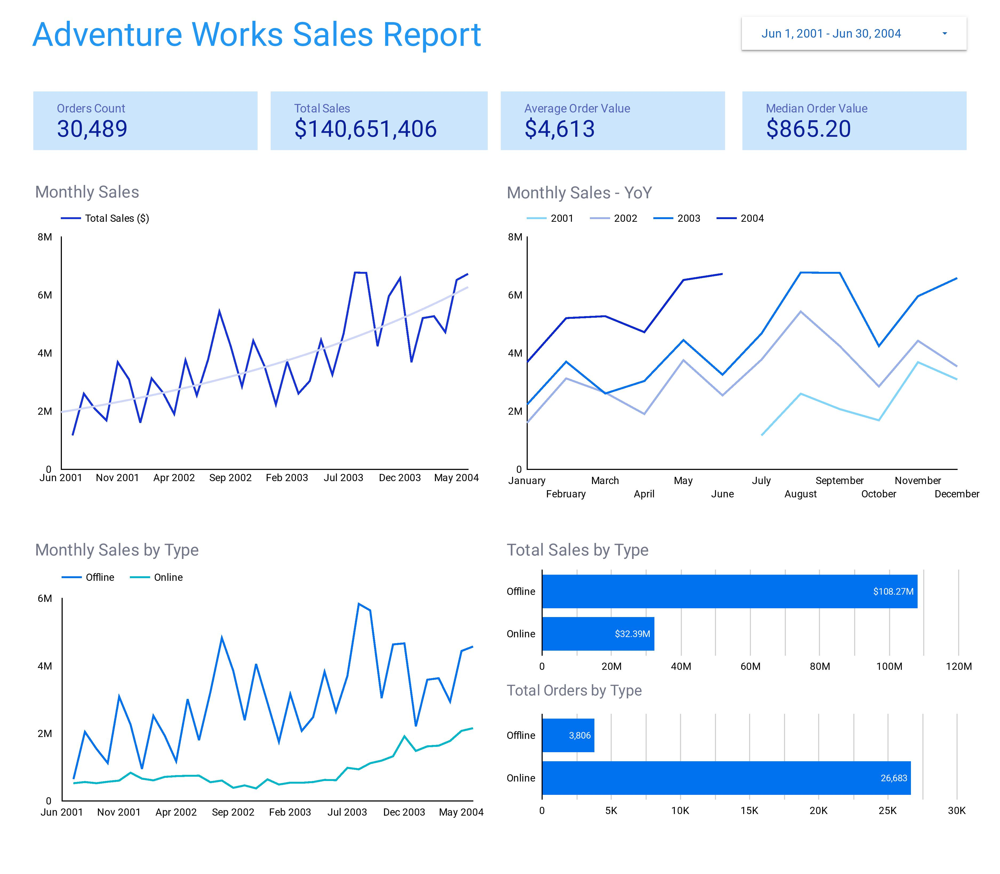
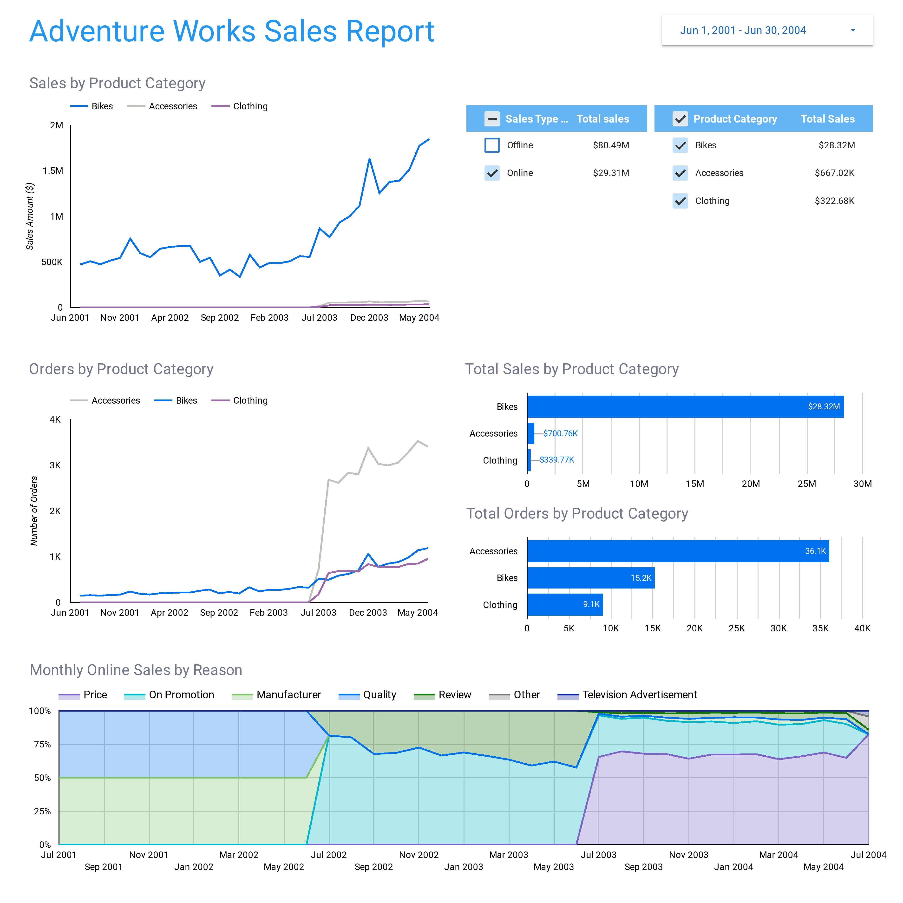
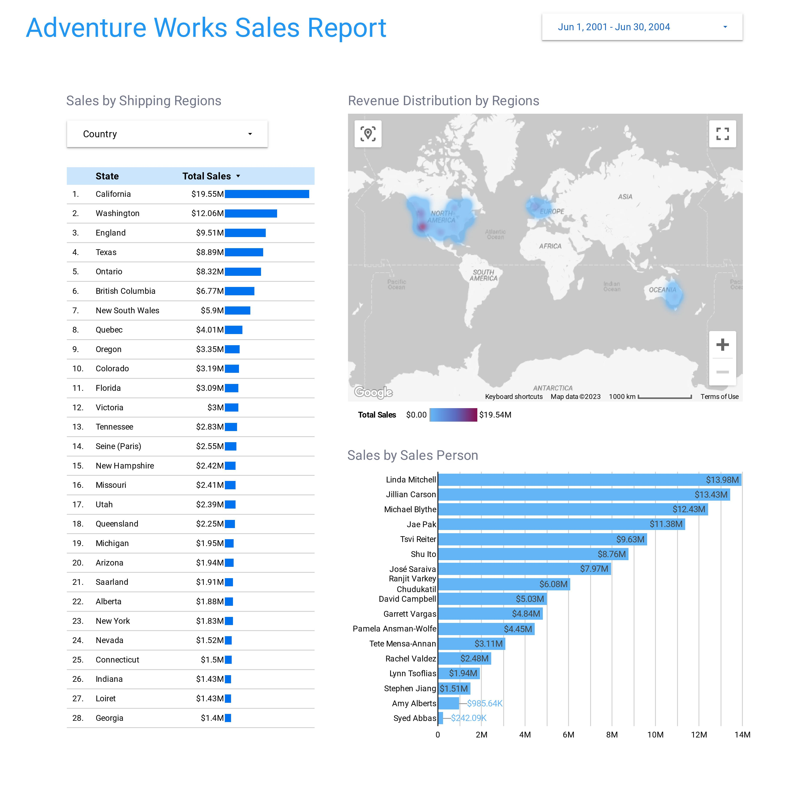
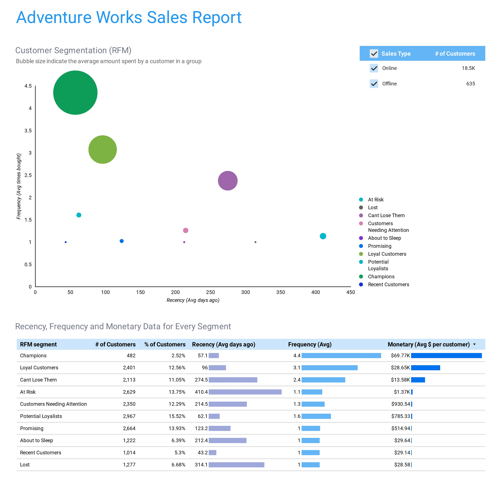
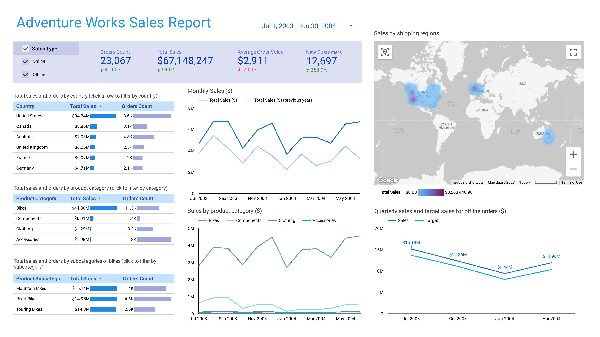
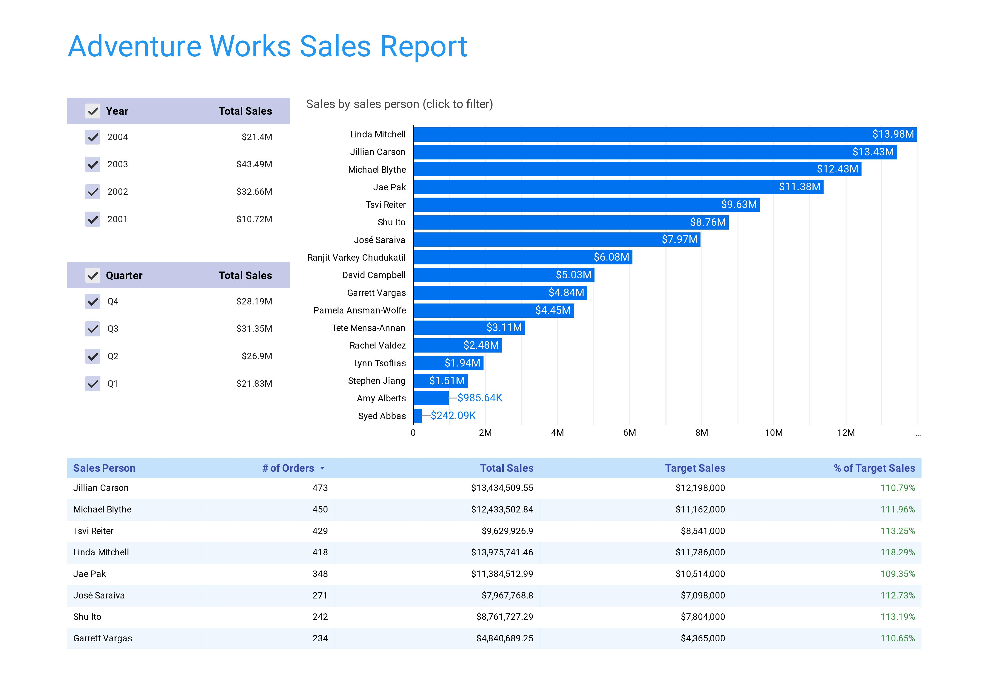

# Visualizing Data using Looker Studio

Adventure Works is a fictitious company specializing in the manufacturing and sale of bicycles and cycling-related products. 

Schema for the AdventureWorks database can be found [here](https://github.com/AlinaLescinskaite/Data_Analytics_Projects/blob/main/Looker_Studio_Dashboards/AdventureWorks_Schema.jpg).

## Task 

Create an interactive sales dashboard that leverages Adventure Works company's data to provide stakeholders with actionable insights.

## Dashboard 1
Interactive dashboard can be found [here](https://lookerstudio.google.com/s/pVmSgI6N3q8).

### Page 1

### Page 2

### Page 3

### Page 4

## Dashboard 2
Interactive dashboard can be found [here](https://lookerstudio.google.com/s/jGA-X9Ed-qc).

### Page 1

### Page 2

